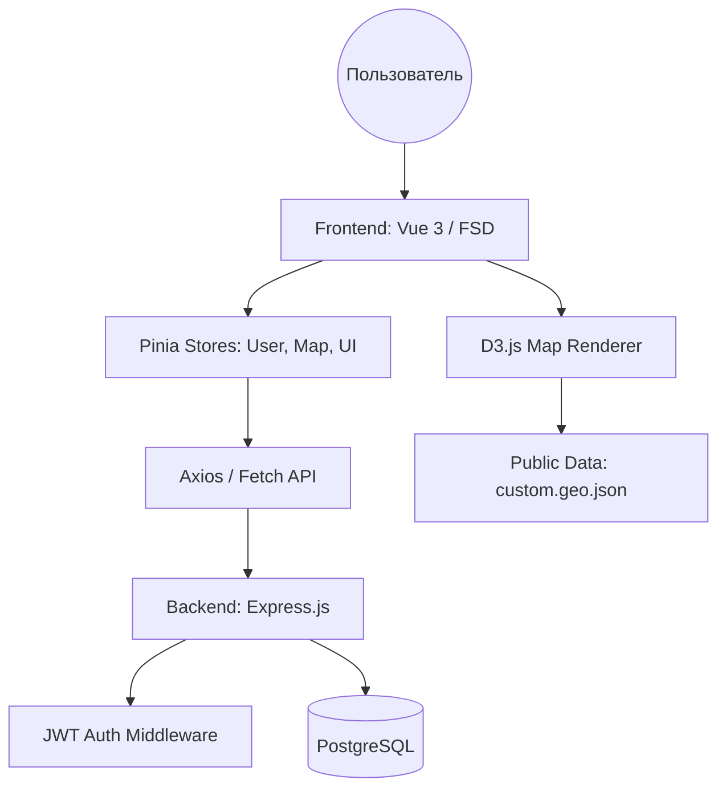

Вот подробный и структурированный **README.md** для твоего проекта **TravelMap**, оформленный в стиле профессиональной технической документации.

---

# TravelMap — Интерактивный атлас и система учета путешествий

> **TravelMap** — это полнофункциональное веб-приложение для путешественников, объединяющее интерактивную карту мира, элементы геймификации (экономика, игры, магазин) и социальную платформу для обмена опытом.

---

## Содержание

1. [Обзор проекта](#1-обзор-проекта)
2. [Стек технологий](#2-стек-технологий)
3. [Функциональные возможности](#3-функциональные-возможности)
4. [Архитектура системы](#4-архитектура-система)
5. [Структура проекта](#5-структура-проекта)
6. [База данных](#6-база-данных)
7. [Frontend — Vue 3 + D3.js Engine](#7-frontend--vue-3--d3js-engine)
8. [Backend — Node.js REST API](#8-backend--nodejs-rest-api)
9. [Геймификация и Экономика](#9-геймификация-и-экономика)
10. [Запуск проекта](#10-запуск-проекта)
11. [API-справочник](#11-api-справочник)
12. [Переменные окружения](#12-переменные-окружения)

---

## 1. Обзор проекта

**TravelMap** превращает изучение географии и фиксацию своих поездок в увлекательный процесс. Сердце приложения — кастомный движок карты на D3.js, позволяющий бесшовно переключаться между визуальными стилями (от классического цифрового до «деревянного» крафтового). Приложение включает систему регистрации «цифровой личности» пилота, накопление миль (кредитов) и социальное взаимодействие через локальные чаты стран.

---

## 2. Стек технологий

| Слой | Технология | Описание |
|---|---|---|
| **Frontend** | Vue 3 (Composition API) | Основной фреймворк |
| **Map Engine** | D3.js | Визуализация GeoJSON, зум, проекция Меркатора |
| **State Management** | Pinia + Persistence | Хранение состояния пользователя и карты |
| **Styling** | Tailwind CSS 4.0 | Современная верстка и темизация |
| **Architecture** | FSD (Feature-Sliced Design) | Модульная методология фронтенда |
| **Backend** | Node.js + Express | Серверная логика |
| **Database** | PostgreSQL | Реляционное хранилище данных |
| **Auth** | JWT + Bcrypt | Защита данных и паролей |
| **Tooling** | Vite, TypeScript | Сборка и типизация |

---

## 3. Функциональные возможности

### 🗺 Интерактивная карта
- **Визуализация:** Отрисовка границ стран через GeoJSON.
- **Темизация:** Динамическая смена стилей (Classic, Wooden, Vintage) с полным изменением UI-переменных.
- **Навигация:** Плавный зум, вращение проекции, "Fly-to" эффект при выборе страны.
- **Инструменты:** Построение маршрутов между странами, измерение дистанции, управление подписями.

### 🎮 Геймификация и Магазин
- **Progress Tracking:** Разблокировка стран и городов (отметка посещенных мест).
- **Мини-игры:** "Guess the Flag" — викторина по флагам стран для заработка кредитов.
- **Shop:** Покупка визуальных тем, уникальных иконок и аксессуаров (шляп) для профиля.
- **Система VIP:** Расширенные лимиты на альбомы и эксклюзивный доступ к чатам.

### 💬 Социальные функции
- **Public Chats:** Локальный чат для каждой страны/города.
- **Memory Albums:** Создание персональных фотоальбомов, привязанных к локациям.
- **Рейтинги:** Оценка стран по 4 критериям: интерес, чистота, люди, доступность.

---

## 4. Архитектура системы



---

## 5. Структура проекта

Проект организован по методологии **Feature-Sliced Design (FSD)**:

```
TravelMap/
├── frontend/               # Клиентская часть
│   ├── src/
│   │   ├── app/            # Провайдеры, стили, инициализация
│   │   ├── pages/          # Страницы (Index, Shop, Settings, Profile)
│   │   ├── widgets/        # Крупные блоки (Sidebar, Console, MapTools)
│   │   ├── features/       # Логика (Auth, LangSwitcher, Games)
│   │   ├── entities/       # Бизнес-сущности (User, Country, MapTheme)
│   │   └── shared/         # UI-kit, API, MapEngine Core
│   └── public/data/        # Гео-данные (GeoJSON)
├── backend/                # Серверная часть
│   ├── src/
│   │   ├── modules/        # Модули (Auth, Economy, Map, Users)
│   │   ├── shared/         # DB Connection, Middleware
│   │   └── server.ts       # Express App Entry
│   └── package.json
└── README.md
```

---

## 6. База данных

Проект использует **PostgreSQL**. Схема нормализована для хранения прогресса и инвентаря.

### Основные таблицы:

- `users`: Хранит профиль, хэш пароля и баланс.
- `user_inventory`: Купленные предметы (темы, шляпы, эмодзи).
- `unlocked_countries`: Список открытых стран для каждого пользователя.
- `visited_cities`: Посещенные города внутри стран.
- `country_ratings`: Пользовательские оценки локаций.
- `posts`: Сообщения в чатах и альбомы.

*(Полный SQL-скрипт инициализации доступен в `backend/src/shared/db/init.sql`)*

---

## 7. Frontend — Vue 3 + D3.js Engine

### Движок карты (`MapRenderer.ts`)
Использует проекцию Меркатора. Особенности:
- **Кэширование:** Рендеринг через `join` для оптимизации производительности.
- **Интерактив:** Реализована кастомная логика вращения (rotation) и центрирования.
- **Слои:** Отдельные слои для границ стран, меток (Labels) и линий маршрутов.

### Темизация (`themeMapper.ts`)
Система тем позволяет менять не только цвета карты, но и весь интерфейс через CSS-переменные:
```typescript
// Пример классической темы
--bg-main: #0c0c0e;
--ui-accent: #fbbf24;
--map-border: #fbbf24;
```

---

## 8. Backend — Node.js REST API

Сервер построен на модульной архитектуре:

- **Auth Module:** JWT-аутентификация с 30-дневным сроком действия токена.
- **Map Module:** Обработка прогресса (открытие стран, сохранение рейтингов).
- **Economy Module:** Логика транзакций при покупке в магазине и начислении наград.
- **Middleware:** `protect` блокирует неавторизованные запросы к API.

---

## 9. Геймификация и Экономика

Приложение использует внутреннюю валюту — **Credits (CR)**.
1. **Заработок:** Мини-игра "Guess the Flag" (+50 CR за верный ответ).
2. **Траты:**
    - Разблокировка страны на карте.
    - Покупка визуальных стилей (например, Wooden Theme — 1000 CR).
    - Кастомизация профиля (эмодзи и шляпы).

---

## 10. Запуск проекта

### Backend
```bash
cd backend
npm install
# Настройте .env (DB_USER, DB_PASSWORD и др.)
npm run dev
```

### Frontend
```bash
cd frontend
npm install
npm run dev
```

---

## 11. API-справочник (Основные эндпоинты)

### Auth
- `POST /api/auth/register` — регистрация.
- `POST /api/auth/login` — вход.

### Map & Progress
- `GET /api/map/progress` — получить список открытых стран и городов.
- `POST /api/map/unlock` — разблокировать страну.
- `POST /api/map/rating` — выставить оценку стране.

### Economy
- `POST /api/economy/buy` — покупка предмета из магазина.
- `POST /api/economy/reward` — начисление награды за игру.

---

## 12. Переменные окружения (`.env`)

```env
PORT=5050
DB_USER=your_user
DB_PASSWORD=your_password
DB_HOST=localhost
DB_PORT=5432
DB_NAME=travelmap
JWT_SECRET=your_ultra_secret_key
```

---

*Разработано в рамках проекта TravelMap Atlas.*